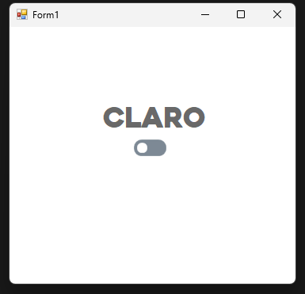
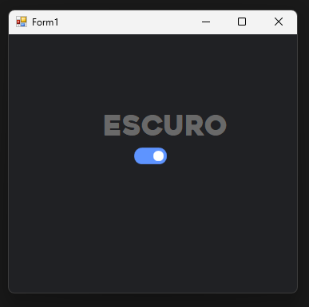

# Projeto de Alternância de Tema (Claro e Escuro) - Windows Forms

Este é um projeto simples desenvolvido em **C#** usando **Windows Forms** para alternar entre os temas **claro** e **escuro**. O tema selecionado é salvo em um arquivo **INI** e é carregado automaticamente na próxima vez que o aplicativo for aberto.

## Funcionalidades

- Alternar entre os temas claro e escuro usando um **ToggleSwitch**.
- Persistência de configuração do tema através de um arquivo **INI**, que armazena a preferência do usuário.
- Interface visual muda instantaneamente para o tema selecionado.
- Utiliza funções da **API do Windows (Kernel32)** para leitura e escrita de arquivos INI.

## Estrutura do Projeto

O projeto é dividido em duas partes principais:

1. **Formulário Windows (Form1.cs)**:
   - Gerencia a interface gráfica e a interação do usuário com o aplicativo.
   - Lê e aplica o tema salvo ao iniciar o aplicativo.
   - Atualiza o tema com base na escolha do usuário e salva essa escolha no arquivo de configuração.

2. **Configurações (Configuracoes.cs)**:
   - Classe responsável pela leitura e escrita de configurações no arquivo **config.ini**.
   - Usa funções da API nativa do Windows para manipulação do arquivo INI.
   - Salva o tema escolhido pelo usuário (claro ou escuro).

## Arquivo INI

O arquivo **config.ini** é gerado automaticamente no diretório de execução do aplicativo. Ele armazena a configuração do tema da seguinte forma:

```ini
[SECTION]
key=dark
```

## Prints do Projeto

Aqui estão alguns prints do projeto para demonstrar sua interface e funcionalidades:



